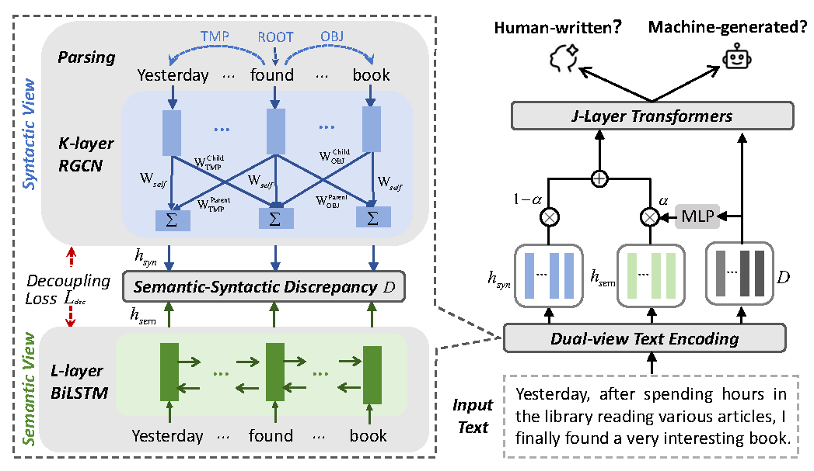

# SSD: Structure-Semantic Discrepancy for LLM-Generated Text Detection



## Catalogue

- [Introduction](#introduction)
- [Environment](#environment)
- [Data Preparation](#data-preparation)
- [Training](#training)
- [Evaluation](#evaluation)
- [Adversarial Attack](#adversarial attack)
- [Expected Performance](#expected-performance)
- [Citation](#citation)

## Introduction

We introduce **SSD (Structure-Semantic Discrepancy)**, a novel model for detecting LLM-generated text. Unlike traditional methods that rely solely on semantic features, SSD jointly leverages **sequential semantics** (via BiLSTM) and **syntactic structure** (via Relational Graph Convolution Networks over dependency parse trees) to capture the discrepancy between human-written and machine-generated text.

The core innovation is the **SSD** mechanism, which:

- Encodes sequential context using a **BiLSTM** (or other) encoder
- Models syntactic dependencies using a **RGCN** over dependency parse graphs
- Computes a **gated fusion** between semantic and structural features to highlight their discrepancy
- Applies **Discrepancy-Based Classification** to produce a sentence-level representation for binary classification (Human vs. LLM-generated)

Additionally, we provide an **adversarial attack pipeline** that tests model robustness through rewrite attack and Decoherence
Attack.

## Environment

- **Ubuntu 20.04**
- **CUDA**: 12.6
- **Python**: 3.10

We recommend using Anaconda to set up the environment:

```bash
conda create -n ssd python=3.10
conda activate ssd
pip install torch torchvision torchaudio --index-url https://download.pytorch.org/whl/cu124
pip install torch_geometric
pip install transformers spacy scikit-learn tqdm nltk langchain-openai
python -m spacy download en_core_web_lg
```

## Data Preparation

### Pre-trained Models Required

Before running the code, download the following pre-trained models:

| Model | Purpose | Path |
|-------|---------|------|
| `roberta-base` | Tokenizer & BERT embeddings | `./models/roberta-base/` |
| `Qwen3` (optional) | Token probability sequence | `./models/Qwen3/` |

These can be downloaded from Hugging Face:

```bash
# Download RoBERTa-base
git lfs install
git clone https://huggingface.co/roberta-base ./models/roberta-base

# Download Qwen3 (optional, for TPS feature)
git clone https://huggingface.co/Qwen/Qwen3-4B ./models/Qwen3
```

### Build Dependency Vocabulary

```bash
python -c "
import json
from utils.dep_parse import sentence_to_dep_matrix

# Build dep2idx from sample texts
dep_set = set()
sample_texts = [
    'The quick brown fox jumps over the lazy dog.',
    'I am writing a research paper on text detection.',
    'This is an example sentence for dependency parsing.'
]
for text in sample_texts:
    adj, tokens, dep_types, pos_tags, tps = sentence_to_dep_matrix(text)
    for row in dep_types:
        for dep in row:
            if dep:
                dep_set.add(dep)

dep2idx = {dep: i for i, dep in enumerate(sorted(dep_set))}
with open('checkpoints/dep2idx.json', 'w') as f:
    json.dump(dep2idx, f, indent=2)
print('dep2idx saved to checkpoints/dep2idx.json')
"
```

### Preprocess Datasets

Raw datasets should be JSON files where each item contains a `text` field (the sentence) and a `result` field (`0` for human-written, `1` for LLM-generated).

Edit `prepare_vocabe.py` to set your input/output paths, then run:

```bash
python prepare_vocabe.py
```

This produces `.pt` files containing preprocessed tensors (input_ids, attention_mask, adjacency matrices, edge types, TPS features, and labels).

## Training

To train the SSD model from scratch:

```bash
python train.py \
  --train_path datasets/train.pt \
  --val_path datasets/val.pt \
  --test_path datasets/AcademicResearch/test.pt \
  --tokenizer ./models/roberta-base \
  --max_len 256 \
  --input_dim 768 \
  --hidden_dim 768 \
  --rgcn_hidden_dim 512 \
  --num_class 2 \
  --lstm_layers 2 \
  --dropout 0.6 \
  --batch_size 128 \
  --epochs 30 \
  --lr 1e-5 \
  --weight_decay 1e-4 \
  --lambda_decouple 1.0 \
  --save_dir ./checkpoints/SSD
```

**Key Training Configurations:**

- **BERT Encoder**: RoBERTa-base is used as a frozen feature extractor (gradients disabled).
- **Decouple Loss**: Controlled by `--lambda_decouple`. Encourages the semantic and structural representations to be complementary.
- **SSD**: The model uses a 2-layer BiLSTM (or other encoder) and a 2-layer RGCN for sequential and structural encoding respectively.
- **Multi-GPU**: The code automatically detects and utilizes multiple GPUs via `nn.DataParallel`.

## Evaluation

To evaluate a trained model on a test set:

```bash
python evaluate.py \
  --test_path datasets/L2R/L2R_llm.pt \
  --tokenizer ./models/roberta-base \
  --max_len 512 \
  --input_dim 768 \
  --hidden_dim 768 \
  --rgcn_hidden_dim 512 \
  --num_class 2 \
  --lstm_layers 2 \
  --dropout 0.5 \
  --batch_size 128 \
  --save_dir ./checkpoints/SSD
```

The evaluation script automatically loads the `best_model.pt` checkpoint from the specified `--save_dir` and reports the following metrics:

- **Accuracy**: Binary classification accuracy
- **Precision**: Macro-averaged precision
- **Recall**: Macro-averaged recall
- **F1-score**: Macro-averaged F1
- **AUROC**: Area Under the Receiver Operating Characteristic curve

## Adversarial Attack

We provide an adversarial attack pipeline in `attack.py` to evaluate model robustness:

### Rewrite Attack

Uses DeepSeek (via LangChain) to rewrite text while preserving meaning:

```bash
export DS_DEEPSEEK_API_KEY="your-api-key"
python attack.py
```

The script launches 10 threads in parallel, each processing a separate JSON file (`datasets/Attack/test{0-9}.json`). The rewritten outputs are saved to `datasets/Attack/test{0-9}_output.json`.

### Decoherence Attack

Swaps adjacent words in sentences exceeding a threshold length to create perturbed variants. Edit the input/output file paths in the `main()` function of `attack.py`, then run:

```bash
python attack.py
```

## Expected Performance

In-domain performance comparison in terms of AUROC scores (%). Bolded values indicate the maximum scores, while underlined values denote the second-highest scores. AVERAGE measures the average performance among all independent domains, and STD measures the standard deviation across domains. SSD achieves the highest average (96.43%) and lowest standard deviation (3.88%), demonstrating superior and more stable in-domain detection.

| Domain | Fast-DetectGPT | RAIDAR | Lastde | Ghostbusters | L2R | SSD |
|--------|:--------------:|:------:|:------:|:------------:|:---:|:---:|
| AcademicResearch | 48.55 | 83.11 | 60.87 | 65.70 | 84.06 | **95.64** |
| ArtCulture | 63.25 | 77.11 | 78.97 | 67.55 | 83.28 | **96.23** |
| Business | 69.29 | 83.69 | 84.70 | 84.41 | 91.56 | **96.99** |
| Code | 69.42 | 38.40 | 84.42 | 38.38 | 83.83 | **99.99** |
| EducationMaterial | 75.46 | 96.75 | 89.75 | 85.23 | 96.44 | **98.45** |
| Entertainment | 85.01 | 83.19 | 97.88 | 87.39 | 94.94 | **98.93** |
| Environmental | 83.25 | 92.28 | 98.26 | 84.17 | 97.86 | **99.99** |
| Finance | 69.69 | 81.53 | 84.71 | 78.82 | 94.00 | **98.25** |
| FoodCuisine | 76.84 | 78.31 | 90.31 | 68.46 | 95.47 | **97.69** |
| GovernmentPublic | 71.46 | 76.19 | 85.77 | 68.28 | 86.75 | **94.99** |
| LegalDocument | 83.77 | 65.94 | **99.67** | 54.14 | 78.03 | 97.61 |
| LiteratureCreativeWriting | 79.43 | 91.61 | 95.99 | 94.56 | 92.94 | **99.47** |
| MedicalText | 56.48 | 77.00 | **91.15** | 63.67 | 78.57 | 86.76 |
| NewsArticle | 60.82 | 85.47 | 74.11 | 68.66 | 92.42 | **96.00** |
| OnlineContent | 63.12 | 82.31 | 78.56 | 60.22 | 88.81 | **97.33** |
| PersonalCommunication | 55.78 | 72.33 | 70.46 | 70.42 | 82.39 | **88.74** |
| ProductReview | 66.80 | 80.75 | 81.56 | 73.59 | 96.89 | **97.57** |
| Religious | 66.00 | 83.97 | 79.75 | 61.00 | 97.75 | **98.92** |
| Sports | 60.17 | 78.69 | 76.46 | 66.66 | 87.42 | **87.85** |
| TechnicalWriting | 60.96 | 85.75 | 76.36 | 72.30 | 93.69 | **98.33** |
| TravelTourism | 62.47 | 88.97 | 79.16 | 76.07 | 94.75 | **99.29** |
| **AVERAGE** | 68.00 | 79.70 | 83.69 | 71.01 | 90.09 | **96.43** |
| **STD** | 9.90 | 11.81 | 9.75 | 12.59 | 6.34 | **3.88** |

> **Note**: Actual results may vary depending on data distribution, hyperparameters, and random seeds.
